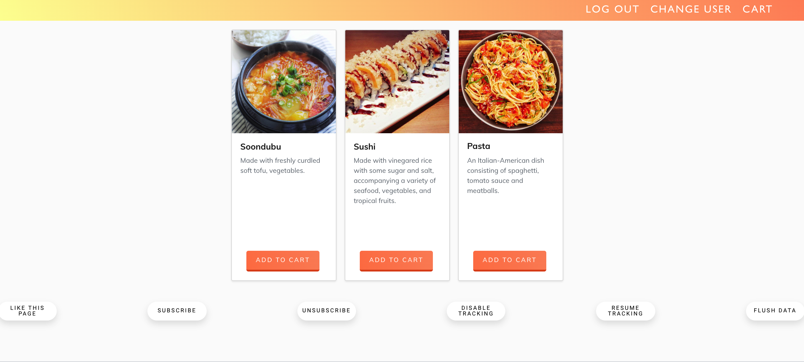

This project made use of [Create React App](https://github.com/facebook/create-react-app).

## Initial Setup
run `npm install && npm run start`

Runs the app in the development mode. 
Open [http://localhost:3006](http://localhost:3006) to view it in the browser.

The page will reload if you make edits. 
You will also see any lint errors in the console.

## About

